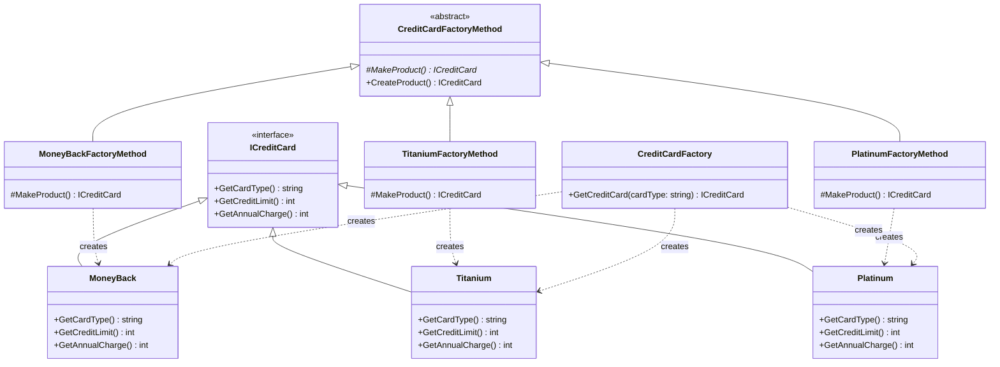
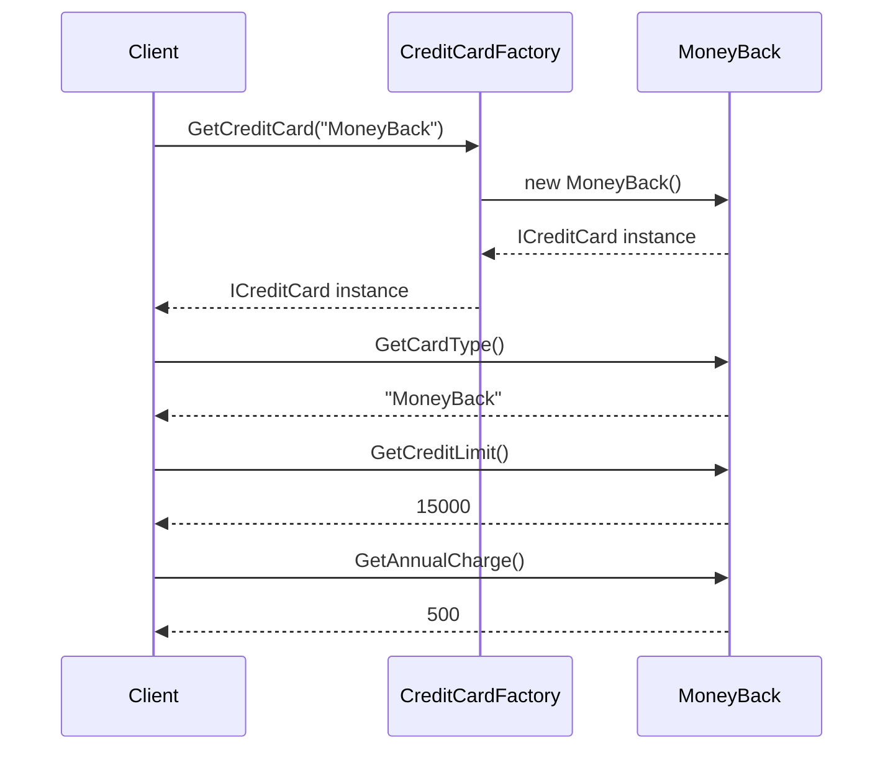
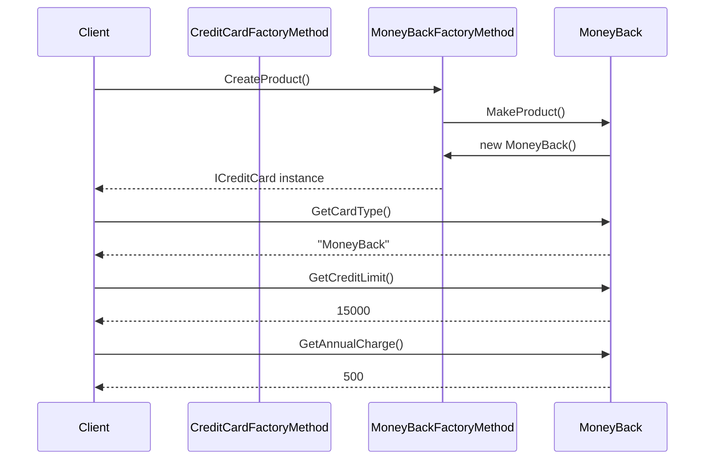
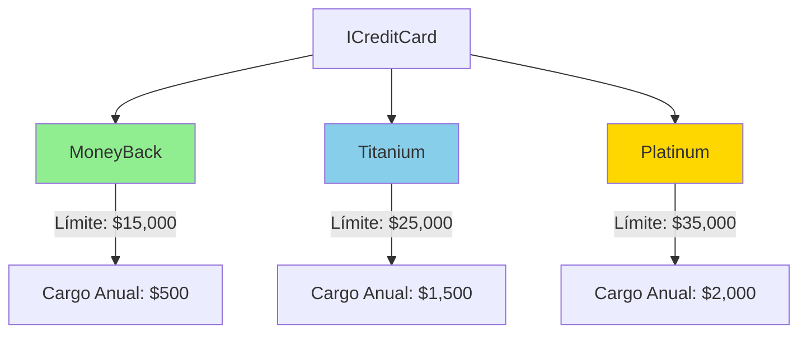
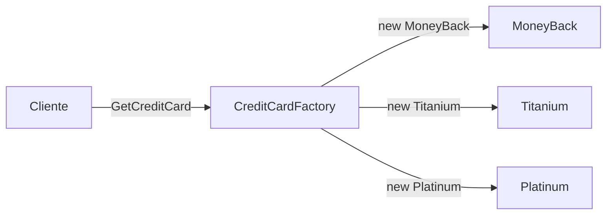
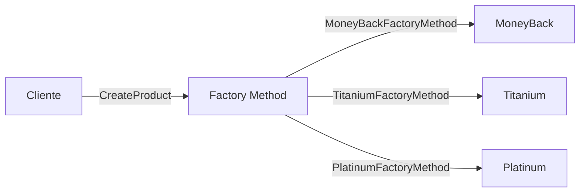

# Diagramas de Diseño - Bank.Domain

## Diagrama de Clases - Factory Pattern

## Diagrama de Secuencia - Factory Method

## Diagrama de Secuencia - Factory Method Pattern

## Tabla de Comparación de Tarjetas

## Casos de Uso

### 1. Creación Simple con Factory

### 2. Creación con Factory Method

